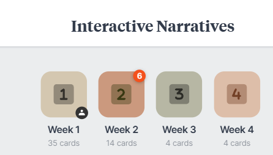

# FGCT4007: Interactive Narratives

FGCT4007: Interactive Narratives

Keisha Byrne

2401317

## Research

### What sources or references have you identified as relevant to this task?

I identified some sources that would have been that would be beneficial for this project and I decided to explore written sources like forums about bank heist games. I just explored what the feedback was from them and what people would find interesting in bank heist games after having played a few. I felt like if I looked at like reviews then it would relate to the brief as it's an interactive game so I wanted to make sure that all the details were there and that we wasn't missing any details in the environment as well as in the mechanics as I wanted the game to feel immersive as well as having fun.

 I wanted to avoid YouTube reviews on these games because some of those reviews can be quite biased and I just wanted it from players perspective rather than a content creator perspective as the player is the target audience in this case so I found that would have given us the most genuine responses and be able to tailor the game exactly to those needs that people will have wanted to be met.

#### Sources

I found two sources that I ended up really enjoying what they had spoken about. One source (What Would Make The Perfect Bank Robbing Game? - News & General Discussion, 2015) was someone who said that when they look around the game world there's not a lot of people and a world of  500 shouldn't have 500,000 cops. This was quite important because it meant that we had to focus on making the right amount of police AI in the game in comparison to the population so that it felt like more realistic. This impacted the amount of AI that we chose to have in the end.

 There was also another comment saying that hiest games shouldn't just be a run in game, that there should be some planning involved.(What Would Make The Perfect Bank Robbing Game? - News & General Discussion, 2015) When we were deciding our game and how it would run we made sure that there was different steps involved before the player could get to the Vault where the money is. For example we decided on the players having to go talk to the NPCs to get a key card to unlock the vault and a password that they had to find out through security or the CCTV. This just makes it feel  that there's more to do in the game rather than just running in  straight for the money as they have to work for it. This creates a bit of a challenge for the player, making the game more enjoyable. 
 
  There was also another quote that someone said in response to a bank heist escape room they played (Mairi, 2021). Mairi said that they never felt like they were actually in a high security vault. So we took this upon ourselves and made sure that the design and the surrounding areas of that actual building we're in had a lot of assets on them. For example picture frames which told a story. This makes the player feel like they are in the game rather than it just being an empty room with money on the floor. So this impacted the design of the level layout in order to make it more immersive.

I found these sources beneficial as a developer because it allowed me to broadcast to the designers the aspects we need to make the game more immersive and more fun and make sure that we wasn't missing anything so that the player had a really positive experience. These sources in my opinion were very good and I agree with them as well especially the the number of the AI. 

## Implementation

### What was the process of completing the task? What influenced your decision making?

When we were given this project I started by making a figma board (Figma, s.d.) and I was given a flowchart on how the game would exactly plan out. Then from this flow chart, I broke it down and found the game mechanics that we would need and I wrote it on a sticky note on the side of the flow chart so that I could see exactly what needed to be done. I then just went through the list 1 by 1 allowing myself to have enough time to be able to implement all these mechanics and plan accordingly to what I would do each week so that we were on track.

Figure 1. Figma board of game mechanics and flow chart.

 We also had a Milanote (Campbell, s.d.) where we have all of our sources and our ideas and our planning down as well so that we were all on the same track. This avoided miscommunication which allowed the group to flow quite well when it came to making the game.

 

Figure .
 

### What creative or technical approaches did you use or try, and how did this contribute to the outcome?

Part of one of the game mechanics was we wanted a water gun instead of like a gun with bullet so this meant that I had to work with a new system in Unreal which was the Niagra system. I have never worked with particles before so I found this quite challenging at first so it took a bit longer for me to do as I had to do a lot of research into how the system actually works by watching some YouTube videos and looking up documentation but after a while I started slowly getting more comfortable with it and I feel like it came out really effective. I feel more comfortable with working with the Niagara system in the future as well.

### Did you have any technical difficulties? If so, what were they and did you manage to overcome them?

I had some difficulties with the water coming out the gun as it did not look like water so I had to change the particle effect that I used a couple of times until it represented water. This was a little bit time consuming but it didnt have an effect on the development process. I also had some difficulties with the AI detecting the particles when it hit them so I had to adjust my line trace and figure out where I was actually hitting by debugging it quite a lot. I also had to debug the button to turn off the CCTV cameras because the material was not working correctly and I realised that all it needed was an is valid node and that managed to fix that issue. 

## Outcome

Here you can put links required for delivery of the task, ensure they are properly labelled appropriately and the links function. The required components can vary between tasks, you can find a definative list in the Assessment Information. Images and code snippets can be embedded and annotated if appropriate.

## Critical Reflection

### What did or did not work well and why?

I think that we managed to fit the briefing quite well with having four different NPCs that affected the progress in the game meaning the player has to talk to all of the NPCs and interact with them to be able to find out the codes and where the key card is to be able to get to the vault for the money for example. We made our own lore behind the game as well which made the game quite religion heavy. I think this makes it a lot more interactive and feel like that there's depth to the game rather than it just being you go in get money. I also feel as a group we can communicated really well and everything that was needed was on time so this didn't stop the development or slow us down in any way so we were able to work quite effectively and efficiently.I also think we planned quite well so we were never lost during this whole process which made us be able to stay on task and the things that we implemented we're also on the right track.

- What did not work well? What parts of the assignment that you felt did not fit the brief or ended up being lacklustre.

### What would you do differently next time?

- Are there any new approaches, methodologies or different software that you wish to incorporate if you have another chance?
- Is there another aspect you believe should have been the focus?

## Bibliography

Open and Close Door Tutorial in Unreal Engine 5 (2024) At: https://www.youtube.com/watch?v=XYEhlkd3YNs (Accessed  17/05/2025).
 
 Open Doors With A Password In Unreal Engine 5 Using Blueprints (2023) At: https://www.youtube.com/watch?v=_PCp21x2pCI (Accessed  17/05/2025).

How To Create Dynamic CCTV/Security Cameras In Unreal Engine 5 (Tutorial) (2024) At: https://www.youtube.com/watch?v=WkOydCLTbVQ (Accessed  17/05/2025).
 
 Score system in Unreal Engine 5 in under 4 minutes (2022) At: https://www.youtube.com/watch?v=sAy-rCwJ8y8 (Accessed  17/05/2025).

How To Make Keycard Doors | Unreal Engine 5 Tutorial (2024) At: https://www.youtube.com/watch?v=d6PEmrdtUjM (Accessed  17/05/2025).

How To Create A Timer And Stopwatch In Unreal Engine 5 (Tutorial) (2024) At: https://www.youtube.com/watch?v=e_oNZAFfrbk (Accessed  17/05/2025).

AI Sight Detection And Chase - Unreal Engine 5 Tutorial (2022) At: https://www.youtube.com/watch?v=tKrBdxm4uxI (Accessed  17/05/2025).

AI Random Roam | Basic Roaming - Unreal Engine 5 Tutorial (2022) At: https://www.youtube.com/watch?v=Mi7r0LqUmOE (Accessed  17/05/2025).

Player Catching AI UE5.1 | Unreal Simple Enemy AI 3 of 3 (2023) At: https://www.youtube.com/watch?v=CnmQDqZLnlg (Accessed  17/05/2025).

What Would Make The Perfect Bank Robbing Game? - News & General Discussion (2015) At: https://discussions.unity.com/t/what-would-make-the-perfect-bank-robbing-game/588230 (Accessed  17/05/2025).

Mairi (2021) Escape Entertainment: Bank Heist | Review. At: https://theescaperoomer.com/escape-entertainment-bank-heist-review/ (Accessed  17/05/2025).

## Declared Assets

Chewy Bubble Font | dafont.com (s.d.) At: https://www.dafont.com/chewy-bubble.font (Accessed  17/05/2025).

The following assets were created or modified with the use of GPT 4o:

- Development Journal.html

